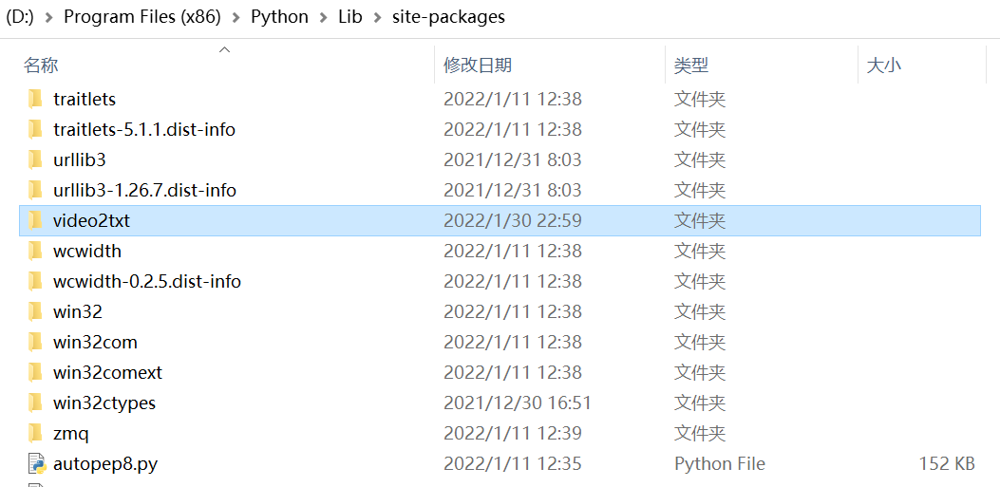

# video2txt

[TOC]

> - version : 1.0
> - author : ZhengYinloong
> - githubRep-url : [video2txt](https://github.com/zhengyinloong/video2txt)
> - requirements : cv2, os

## 简介

video2txt包由我原来一时兴起写的的ImgToTxt模块发展而来，经过多次完善，形成了由三个功能模块(captureImg.py, putTxt2File.py, display.py)，一个初始化文件(\__init__.py)和一个主程序执行文件(main.py)组成的比较完善的视频转字符画工具包。

## 各模块/文件功能概览

|             模块/文件              |                       功能                       |                        包含的类或函数                        |
| :--------------------------------: | :----------------------------------------------: | :----------------------------------------------------------: |
|  [\__init__.py](#  \__init__.py)   |                    初始化参数                    |                       class：Video2Txt                       |
|  [captureImg.py](# captureImg.py)  |              提取视频帧并保存为图片              | function：capPosFrame(), captureImgs(), do(), frameResize(), getTotalFrames(), saveImg(), showPosFrame() |
| [putTxt2File.py](# putTxt2File.py) |  识别图片像素灰度并用字符代替，存放在txt文件中   | function：do(), getOneRowChar(), getText(), gray2Char(), imgResize(), putTxt2File() |
|     [display.py](# display.py)     |             将txt文件依次输出在终端              |              function：clear(), do(), showTxt()              |
|        [main.py](# main.py)        | 依次执行各模块do()函数，运行该程序可直接达到目的 |                        function：do()                        |

## 详细说明

### \__init__.py

该文件中定义了一个`Video2Txt`类用来初始化参数，包含以下属性：

| 属性           | 默认值                                                       | 说明                                                         |
| :------------- | :----------------------------------------------------------- | :----------------------------------------------------------- |
| FPS            | 24                                                           | \< float ＞0 > txt文件“播放”的“帧率”                         |
| GRAY_SCALE_STR | r'$@B%8&WM#*oahkbdpqwmZO0QLCJUYXzcvunxrjft/\|()1{}[]?-_+~<>i!lI;:,"^`. ' | \< str > 灰度等级字符                                        |
| IMG_FOLDER     | 'imgs_default'                                               | \< str > img文件要存放的文件夹                               |
| IMG_FORMAT     | 'bmp'                                                        | \< str > 图片保存格式                                        |
| IMG_HEIGHT     | 100                                                          | \< int > 图片重新设置 高                                     |
| IMG_WIDTH      | 100                                                          | \< int > 图片重新设置 宽                                     |
| RATIO          | 4 / 9                                                        | \< float > 根据cmd终端字符比例（属性->字体）调整字符画（宽 / 高） |
| SCALE          | 1.0                                                          | \< float > 转字符画时对图片缩放                              |
| STEP           | 10                                                           | \< int > 跳帧，默认每十帧取一帧                              |
| TXT_FOLDER     | 'txts_default'                                               | \< str > txt文件要存放的文件夹                               |
| VIDEO_NAME     | 'video/video_default.mp4'                                    | \< str > 视频文件                                            |

### captureImg.py

该模块的功能是提取视频帧并保存为图片

###  putTxt2File.py

### display.py

### main.py

## 安装与使用

1. `安装前提`：先安装cv2包

2. 安装好cv2后，直接下载或clone该仓库到你的设备上python解释器所在文件夹下 `Lib>site-packages` 中（如下图所示），即可在你的设备上任何IDE的.py文件中调用该包中任何模块、类和函数。

   

## BUG

该工具包目前有一个已知bug：

由于`captureImg.saveImg()`中调用了`cv2.imwrite()`函数,会出现内存中一直加载文件目录无法释放的问题，这会导致调用后无法对相关文件夹无法进行移动，重命名等操作。这个问题我也是在调试与使用中发现的，一直没有解决的办法😑，欢迎各位多多发pull request啊😀😀

[TOP](# video2txt)

